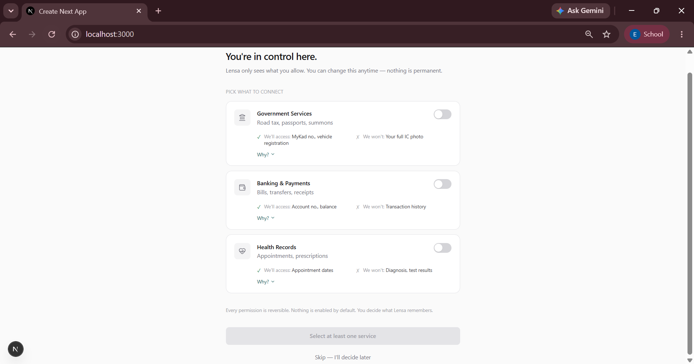
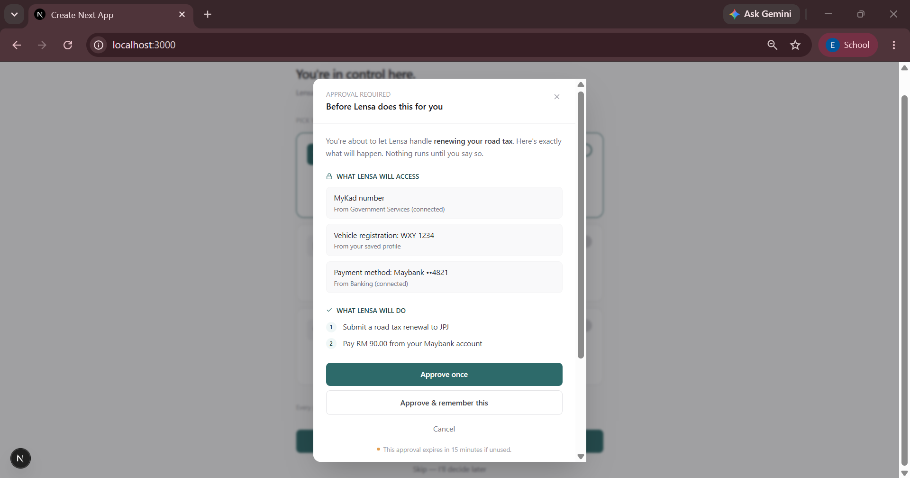
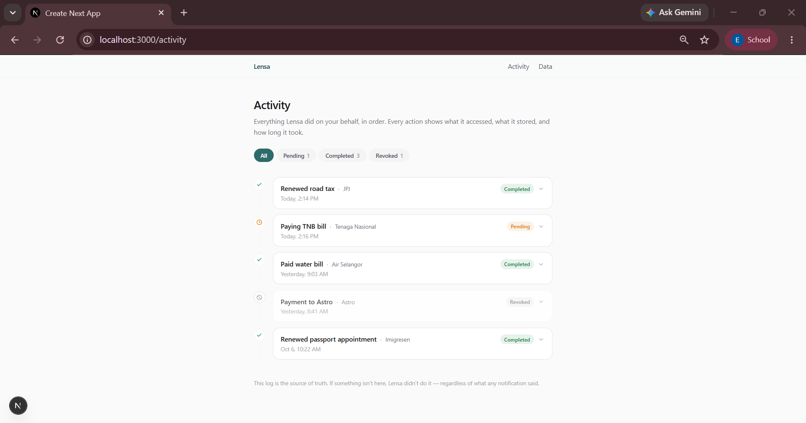
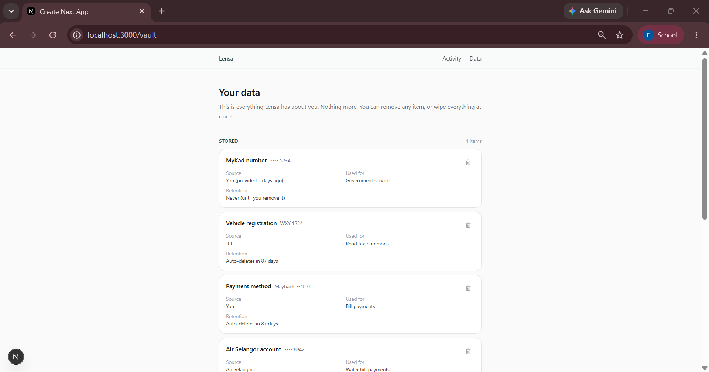

# Lensa

A design fiction for a transparent AI agent that handles government, banking, and utility tasks on your behalf — and shows you exactly what it's doing, every step of the way.

Built with Next.js 16, React 19, Tailwind v4, and Framer Motion.

---

## Why I built this

I build things for fun. Most of my side projects are small: a utility, a scraper, something to solve a specific annoyance. This one grew bigger because the question at the center of it kept pulling me in.

The question: **what would AI actually look like if it were designed for the person using it, rather than for the company deploying it?**

Every AI product I've used is built around the same assumption — that the more the AI can do, the better. More autonomy, more integrations, more data, more actions taken on your behalf. The convenience is real. But so is the creeping sense that you don't quite know what it just did, or what it knows about you, or how to make it stop.

Lensa is my attempt to sketch the opposite. Not a manifesto. Just a working prototype that answers a narrow question: **what if transparency were the product, not the footnote?**

---

## The premise

Lensa is a hypothetical "super aggregator" — an AI agent that handles tasks across government services, banking, and health records through a single identity. The kind of thing every digital government is quietly trying to build.

The interesting part isn't the aggregation. It's the design constraints I gave myself while building it:

1. **Nothing is enabled by default.** The user opts in per service, and every permission is reversible.
2. **Before the AI acts, it shows its work.** Three sections, always: what it will access, what it will do, what it will _not_ do.
3. **Every action leaves a receipt.** A full audit log, with first-class revocation.
4. **The user sees the complete inventory of what's known about them** — including what the system deliberately _doesn't_ know.

That fourth one is the most unusual. Most products don't tell you what they don't collect. Showing the boundary is what makes the rest of the design feel honest.

---

## The screens

### 1. Onboarding — the contract



The first screen isn't a login form. It's a permission architecture. Three toggles — government, banking, health — each defaulted off, each showing exactly what will be accessed and what won't. A "Why?" link expands to plain-language reasoning.

The design decision that mattered most: **the safest option is the default.** No "Enable all for the best experience." No dark patterns. You start with nothing, and you add.

### 2. Approval Modal — the hero screen



Before the AI does anything, it appears as a modal with three sections in fixed order:

- **What Lensa will access** — the exact fields, and where they come from
- **What Lensa will do** — a numbered list of steps
- **What Lensa will NOT do** — the boundary statement

That third section is the whole point of the screen. It's what turns "approve this action" into "understand what you're approving." Real products almost never show this. They should.

Two additional design decisions: `Approve once` is the primary button, not `Approve & remember`. And there's a 15-minute expiry at the bottom, reframing approval as a live decision rather than a click-through.

### 3. Trust Dashboard — the receipt



A reverse-chronological timeline of everything the agent has done. Each row expands to show: what it accessed, what it stored, how long it took. Status is one of three — completed, pending, revoked — with a distinct icon and color for each.

`Revoke access` is a first-class action on every entry. If you can't easily undo something, you don't really control it.

The footer makes a specific promise: _"This log is the source of truth. If something isn't here, Lensa didn't do it — regardless of what any notification said."_

### 4. Data Vault — the control



Two sections. The first is straightforward: everything Lensa knows about you, with metadata on where it came from, what it's used for, and when it auto-deletes. Per-row removal. A global "Delete all my data" behind a type-DELETE confirmation.

The second section is the differentiator: **Not stored.** A list of things Lensa deliberately never sees or keeps — your IC photo, your transaction history, your health diagnosis, your location. Each one has a one-line reason.

This is the screen I'm proudest of. It signals something you rarely see in software: that **what a system refuses to know is a design choice**, and showing it is a form of respect.

---

## What I'd change

If I were building this as a real product rather than a prototype, three things would need to change.

**First, the "will NOT do" section is too easy to fake.** A product could claim it doesn't store your payment details and then do it anyway. Making that promise meaningful requires either cryptographic proof (zero-knowledge proofs, threshold signatures) or external audit. For a prototype, the honesty is expressed in the interface. In production, it would need to be enforced in the architecture.

**Second, the modal is intrusive for high-frequency actions.** For a road tax renewal once every two years, showing a full approval dialog is right. For a recurring bill payment the user has explicitly authorized, it's friction. A real design would need a tiered approval system — inline confirmations for routine actions, full modals for consequential ones.

**Third, the Data Vault is incomplete without a "why do you have this?" trail.** Right now each item shows its source and retention, but not the specific event that caused it to be stored. "You provided this 3 days ago" is a summary. What a user actually wants is the exact moment — which approval, which task, which click. A vault that can't answer that question still leaves a trust gap.

---

## Technical notes

**Stack:** Next.js 16 (App Router), React 19, TypeScript, Tailwind CSS v4, Framer Motion 14. Icons from Lucide. Font is Inter via `next/font`.

**Motion system:** A small set of shared variants (fadeUp, stagger, modal, backdrop) keep transitions consistent. Easing is `[0.22, 1, 0.36, 1]` throughout — a soft ease-out that reads as deliberate rather than playful. The only looping animation is the offline sync pulse.

**Design tokens:** Custom palette defined in `globals.css` via Tailwind v4's `@theme` directive. Three families — `trust` (teals), `signal` (amber/red/green), `surface` (light neutrals). Radius is a single token (`--radius-card: 14px`), so all cards share the same silhouette.

**Accessibility:** Modal uses `role="dialog"`, `aria-modal="true"`, `aria-labelledby`, and closes on Escape or backdrop click. Toggle switches use `role="switch"` and `aria-checked`. Filter chips use `role="tab"` and `aria-selected`. Focus management is on the roadmap.

**State:** No backend. All data is mock, defined in `src/lib/mock-data.ts`. This keeps the prototype focused on interaction design rather than API plumbing.

---

## Running it locally

```bash
git clone https://github.com/ElisaesterYsn/lensa.git
cd lensa
npm install
npm run dev
```
